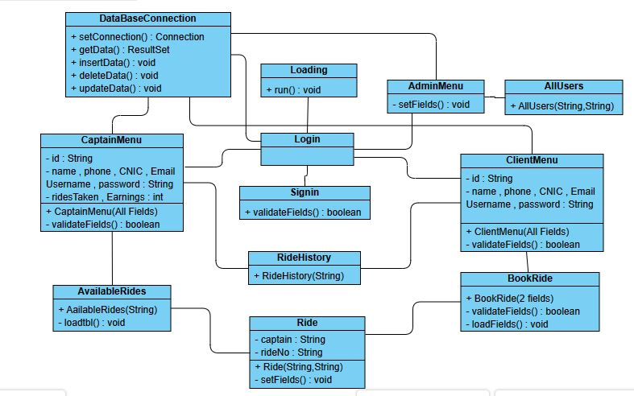
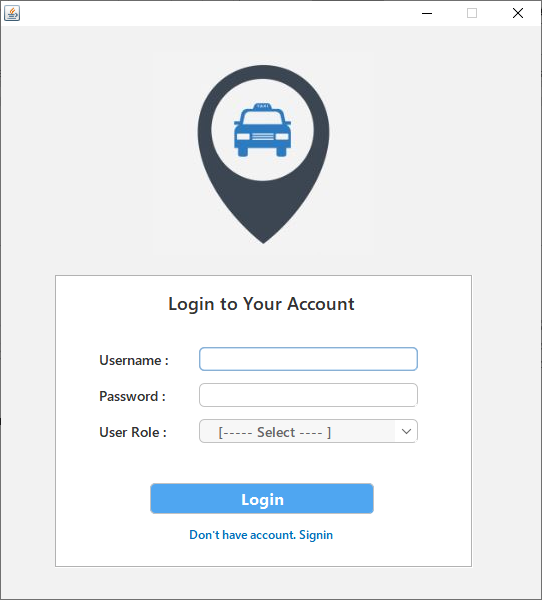
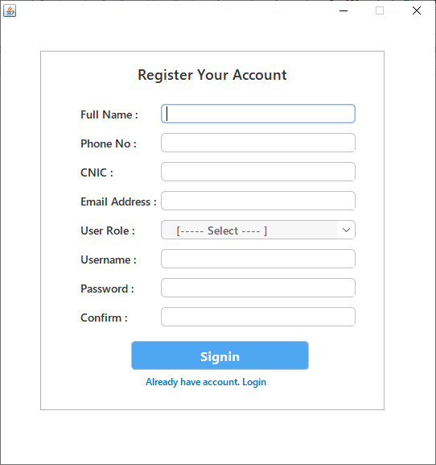
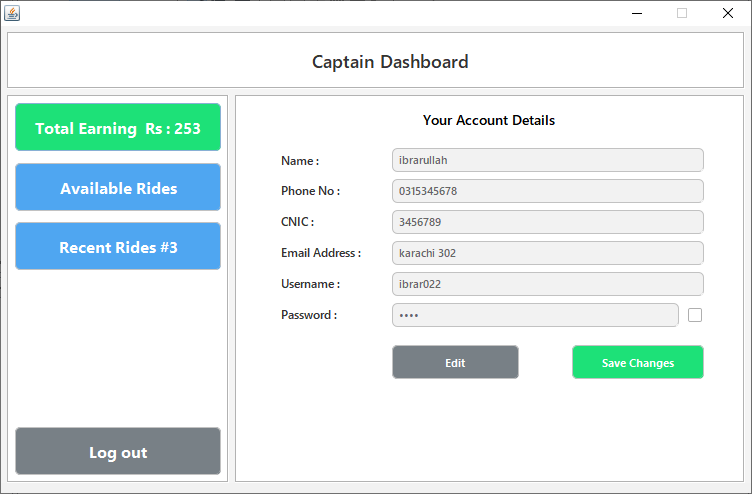
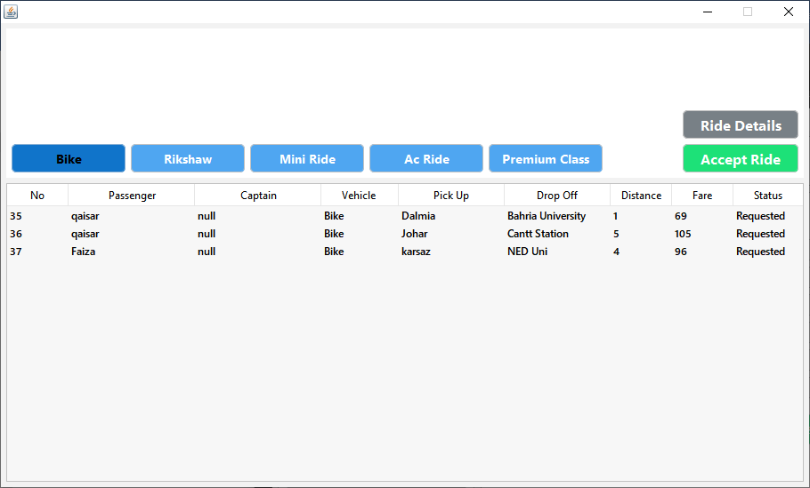
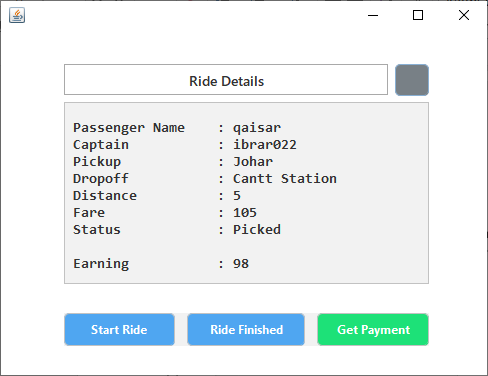
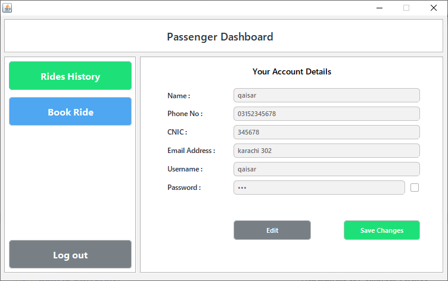
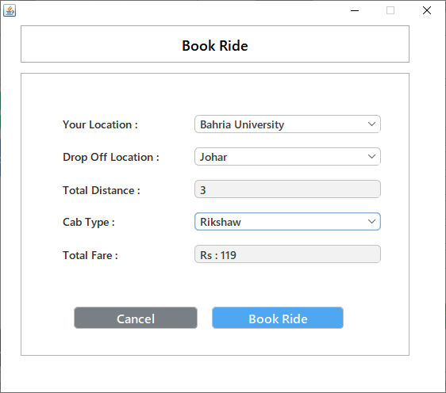
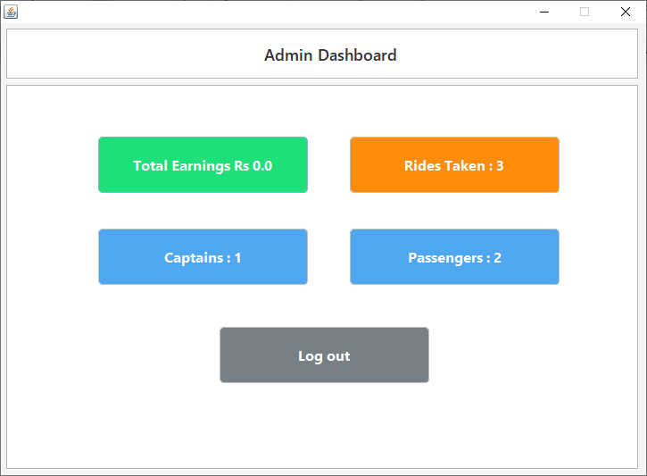

# Cab Service Application

## Overview
This project is a **Cab Service Application** developed using **JavaFX** on **NetBeans**, with **Microsoft Access (ACCDB)** as the database, integrated via **UCanAccess**. The UI is enhanced with **FlatLaf** for a modern look. The application allows users to register as **Passengers** or **Captains**, book and accept rides, track ride history, and manage earnings. An **Admin Panel** provides an overview of rides, earnings, and user records.

## Object-Oriented Design Principles Used
- **Encapsulation**: Data hiding is implemented in user details and ride management.
- **Inheritance**: Common functionalities are inherited across classes.
- **Polymorphism**: Different ride types with dynamic fare calculations.
- **Abstraction**: High-level classes define behavior while implementation is handled in subclasses.

## Features

### 1. User Authentication
- Users can register and log in.
- Users can update their details after registration.

### 2. Passenger Functionalities
- Book rides based on available cab types.
- View ride status after booking.
- Track past rides in ride history.

### 3. Captain Functionalities
- Search for requested rides by selecting their cab type.
- Accept rides and start the journey.
- Calculate earnings (*Total fare - 7% tax deducted*).
- View ride history.

### 4. Admin Functionalities
- View total rides taken.
- View total profit earned.
- Manage and monitor all registered users (*Passengers & Captains*).

## UML Diagram
A **UML class diagram** is included to illustrate the object-oriented design of the project, showing class relationships and interactions.

## Ride Fare Calculation

| Ride Type       | Per Km Fare (PKR) | Base Fare (PKR) |
|----------------|-----------------|-----------------|
| **Bike**       | 9               | 60              |
| **Rikshaw**    | 13              | 80              |
| **Mini Ride**  | 15              | 106             |
| **AC Ride**    | 20              | 120             |
| **Premium**    | 23              | 135             |

## Screens and Functional Flow
### 1. Opening Splash Screen

### 2. Login & Signup Panels

 

### 3. Captain Dashboard
- View available rides
- Accept rides

### 4. Passenger Panel
- View ride details
- Track ride history
- Book rides

### 5. Admin Panel
- View all rides history
- View all captains and passengers
- Track total company earnings

## Tech Stack
- **JavaFX** (for UI development)
- **NetBeans** (IDE for development)
- **Microsoft Access (ACCDB)** (Database)
- **UCanAccess** (JDBC driver for database connectivity)
- **FlatLaf** (Modern UI framework for JavaFX)

## Future Enhancements
- Implementing **real-time ride tracking** with Google Maps API.
- Adding a **rating system** for Captains and Passengers.
- Enhancing security features with **encrypted credentials**.
- Introducing **multiple payment options** (Credit Card, Wallets, etc.).

## Developed By
- **[Ibrar Ullah](https://github.com/ibrarullah23)** (Developer)

